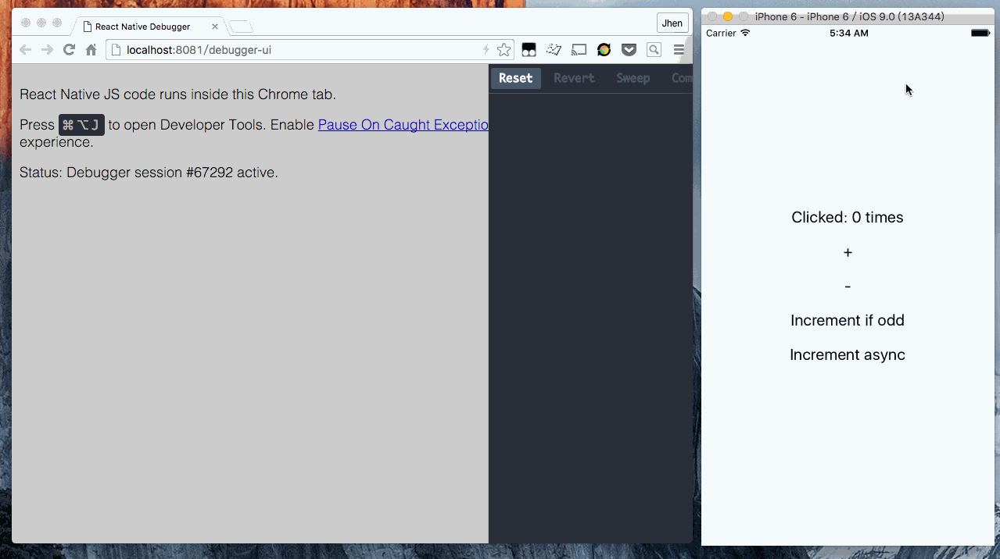

# Remote Redux DevTools monitor on React Native Debugger UI



Inject [remote-redux-devtools](https://github.com/zalmoxisus/remote-redux-devtools) monitor to React Native debugger. The monitor code is edit from [remotedev-app](https://github.com/zalmoxisus/remotedev-app).

## Installation

```bash
$ npm install -g remote-redux-devtools-on-debugger
```

## Usage

```bash
$ remotedev-debugger-replace
```

It will replace `./node_modules/react-native/local-cli/server/util/debugger.html`. We recommend add to `postinstall` task.

## License

[MIT]